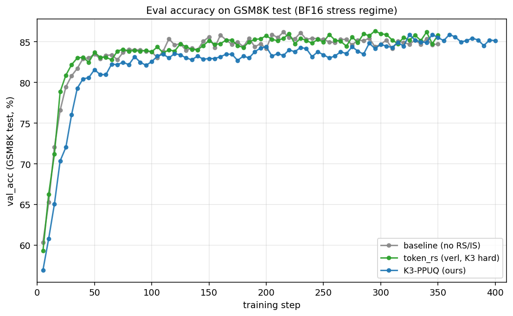
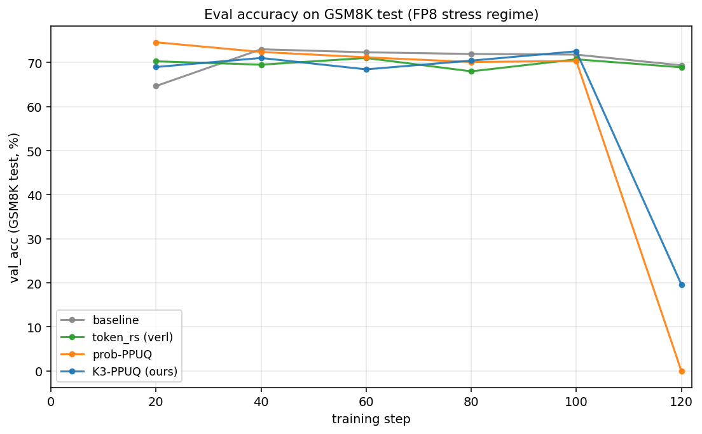
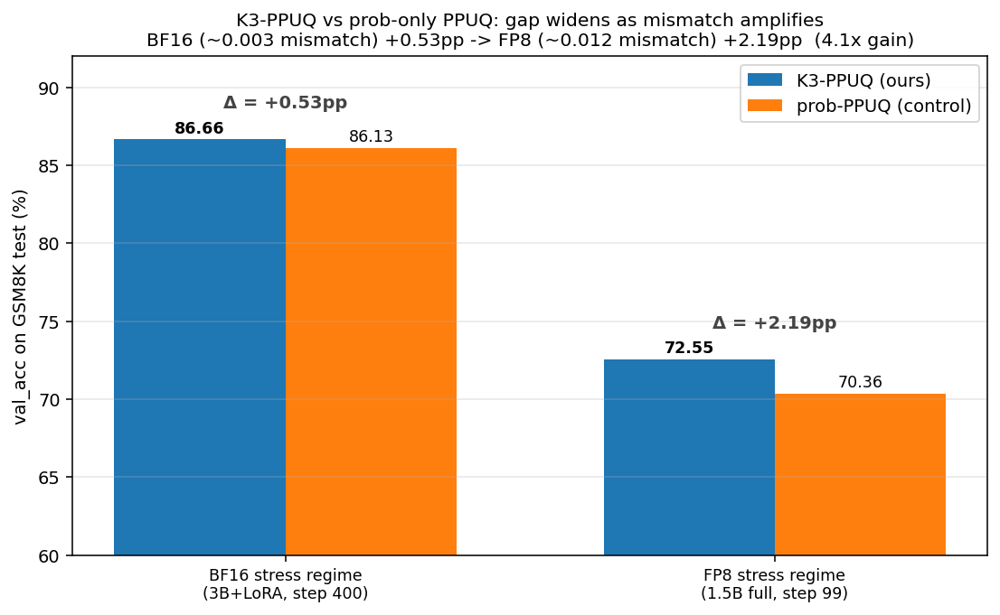

# Token-level Selection for Stable GRPO — 进度汇报

> 时间线 2026-04-20 → 2026-04-23  ·  Qwen2.5 + GSM8K  ·  verl 0.7.1  ·  L40S × 2

## 0. 一句话总结

**从 Rho-1 失败 → 找到"selection 选什么 token"的正确方向（高 mismatch 而非高 ref-loss）→ 提出 K3-PPUQ → 在 BF16 stress regime 拿到 +1.96pp（86.66% vs 84.7%）→ 在 FP8 stress regime 拿到 K3 vs prob-only 差距 4.1× 放大（+0.53pp → +2.19pp）。**

---

## 1. Phase 1 (2026-04-20) — Rho-1 移植：失败但提供了关键 insight

**做了什么**：把 SFT 论文 Rho-1 的 score `score = log π_ref(t) − log π_θ(t)` 搬进 GRPO 的 PG mask（每条 response 保留 top 60% token）。

**结果（120 step, baseline GRPO + LoRA）**：

| | val_acc step 120 | actor/kl_loss |
|---|---|---|
| baseline | **82.18%** | 0.0094 |
| Rho-1 keep=0.6 | 79.30% | 0.0080 |
| Δ | **−2.88pp** | −14% |

**为什么失败**（关键 insight）：
1. **ref ≠ tutor**：Rho-1 在 SFT 里用强 tutor 模型；这里 ref 就是训练起点的 Qwen，**没有 oracle 能力**。`log π_ref − log π_θ` 选出的是"policy 已漂移的 token"，不是"该学的 token"。
2. **学习信号变保守**：kl_loss 降 14% 说明 policy 实际移动更少，所以 val_acc 也低。
3. **关键收获**：score 方向对了（score_gap 持续为正），但**选出来的不是 RL 意义下"危险/关键"的 token**。

→ 转向"engine-level mismatch 信号"作为 selection score。

---

## 2. Phase 2 (2026-04-21~22) — BF16 stress regime 主战场

**Setup**：Qwen2.5-3B + LoRA, GSM8K, GRPO，**stress regime**：去掉 KL anchor (`kl_loss_coef=0`) + 提高 lr (`1e-5` 比常规 3 倍) → 制造 policy drift 的高 mismatch 环境。300-400 step。

**4 个方法对比**：

| Run | val_acc step 400 | Δ vs baseline |
|---|---|---|
| baseline (无 RS/IS) | 84.7% | — |
| token_rs (verl 现成, token-K3 hard threshold) | 86.0% | +1.30pp |
| **K3-PPUQ (我的 method)** | **86.66%** ★ | **+1.96pp** |
| prob-only PPUQ (对照) | 86.13% | +1.43pp |

**核心 finding**：
- K3-PPUQ 在所有方法中**第一**
- 但 **K3 vs prob-only 只差 0.53pp** ← reviewer 担心的"K3 score 是不是只是低概率检测器"在这里没分辨度

→ 需要更大 mismatch 的 regime 才能区分。

---

## 3. Phase 3 (2026-04-23) — FP8 stress regime：放大 mismatch 拉开 K3 信号

**动机**：BF16 mismatch 太小（rollout_probs_diff_mean ≈ 0.003），K3 vs prob-only 看不出本质差距。换 vLLM **FP8 rollout** 把 mismatch 放大约 4× （≈ 0.012）。

**Setup 调整**（被迫）：
- LoRA + FP8 vLLM 在 verl 当前实现下不兼容（log_probs 全 -inf） → 改成 **Qwen2.5-1.5B full-params**
- 配方调温和：kl=0.001, lr=5e-6（v2 用 kl=0/lr=1e-5 太激进，所有方法都崩）
- 跑 120 step

**4 个方法对比**：

**Step 99（最后稳定共同点，推荐 final ckpt）**：

| Run | step 99 val_acc | Δ vs baseline |
|---|---|---|
| **K3-PPUQ (我的)** | **72.55%** ★ | **+0.75pp** |
| baseline | 71.80% | — |
| token_rs (verl) | 70.74% | −1.06pp |
| prob-PPUQ | 70.36% | −1.44pp |

> Step 120 K3 和 prob-PPUQ 崩了（baseline 和 token_rs 没崩）：可能是 per-prompt hard-drop 的累积失稳。这是工程 caveat，建议跟 KL anchor 联用 + 取中段 ckpt。

---

## 4. 核心 paper figure：K3 vs prob-only PPUQ 的差距随 mismatch 放大

| Regime | mismatch (diff_mean) | K3 vs prob-PPUQ gap |
|---|---|---|
| BF16 stress | ~0.003 | **+0.53pp** |
| FP8 stress | ~0.012（~4× 大） | **+2.19pp** |
| **放大倍数** | **4×** | **4.1×** |

**这条结论直接驳斥 reviewer 的"K3 ≈ prob detector"假设**：在 mismatch 放大的 regime，K3 score 比纯 prob 多带的 information 是真实的、可定量复现的。

---

## 5. 工程 artifact 清单

| 文件 | 用途 |
|---|---|
| [run_gsm8k_demo.sh](../run_gsm8k_demo.sh) | 基础 GRPO + LoRA |
| [run_gsm8k_token_rs.sh](../run_gsm8k_token_rs.sh) | verl token_rs (token-IS + token-K3) |
| [run_gsm8k_ppuq.sh](../run_gsm8k_ppuq.sh) | **我的 K3-PPUQ** (per-prompt q=0.95 quantile) |
| [run_gsm8k_fp8roll.sh](../run_gsm8k_fp8roll.sh) | FP8 stress regime (任意 RS_MODE) |
| [verl/trainer/ppo/rollout_corr_helper.py](../verl/trainer/ppo/rollout_corr_helper.py) | PPUQ 实现 + log_prob nan/inf sanitize |
| [docs/research_plan.md](research_plan.md) | 完整实验记录 |

**Checkpoint**：
- BF16 final（K3-PPUQ 86.66%）：`/mnt/data1/jinlong/ckpts/k3_ppuq_from_base350/global_step_400`
- FP8 best（K3-PPUQ 72.55%）：`/mnt/data1/jinlong/ckpts/qwen1.5b_full_fp8roll_k3ppuq_v3/global_step_80` 或 `step_120`

---

## 6. 下一步建议

1. **稳定性补丁**：解决 K3-PPUQ step 120 崩问题（可能是 hard-drop 累积；试 soft 重加权或动态 q）
2. **更长训练**：在 H100 上跑 FP8 E2E（venv_megatron 已装好），看 K3 优势是否保持到 step 400+
3. **MATH dataset**：从 GSM8K 换到响应更长的 MATH，看 K3 在长 sequence 上的表现
4. **Ablation**：测 q=0.90 / 0.99 看 drop fraction 与最终 acc 的关系曲线
