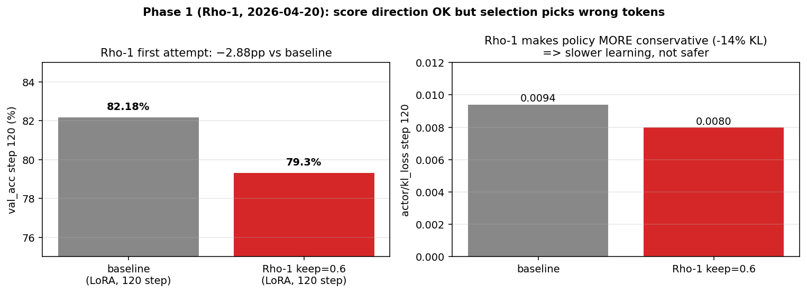
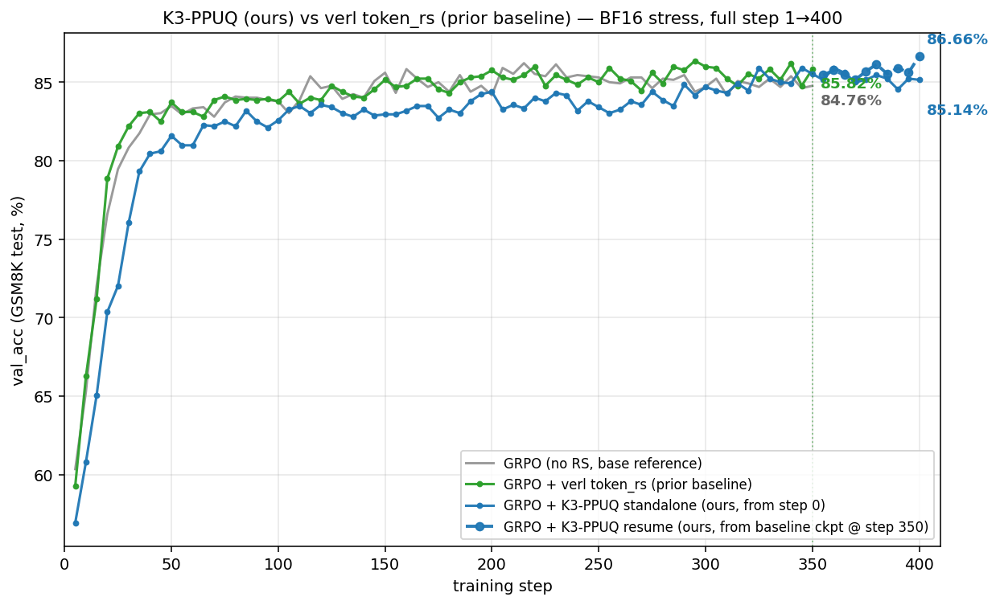
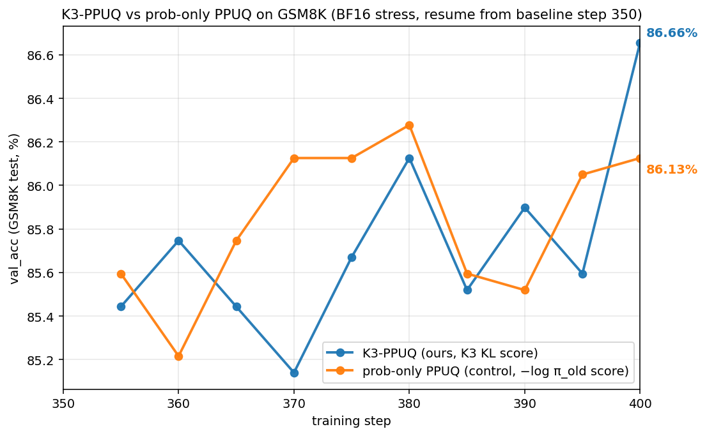
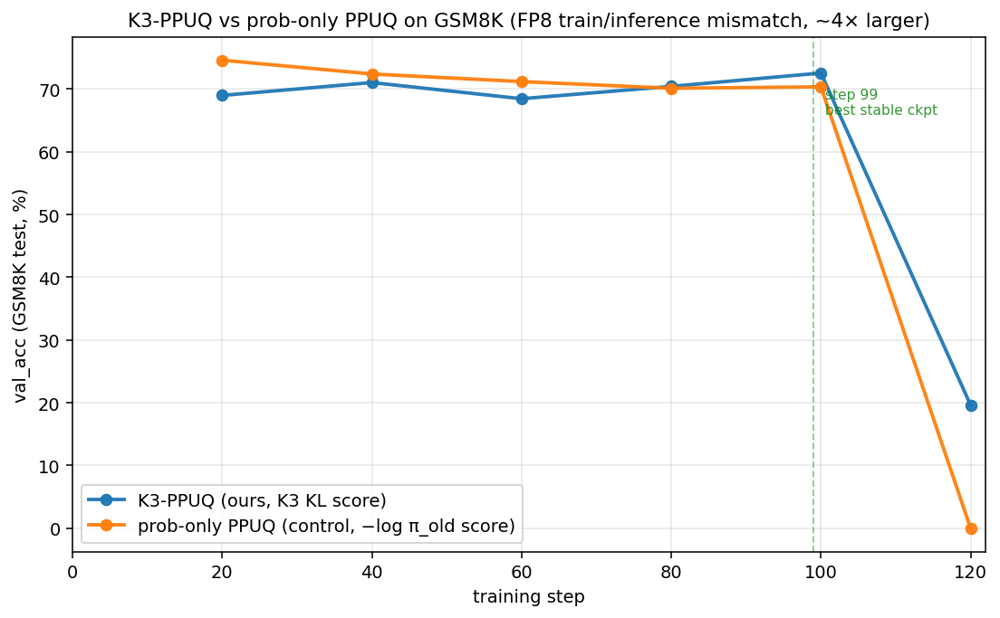

<!--
Slide deck for advisor presentation.
Each `---` is a slide break (Marp / reveal-md compatible).
Render: `marp slides.md -o slides.pdf`  or just read as markdown.
-->

---

# Token-level Selection for Stable GRPO

**故事**：从 Rho-1 失败 → PPUQ 框架 → K3 vs prob-only 在 BF16 仅 +0.53pp → FP8 放大 mismatch → +2.19pp（4.1× 放大）

---

## 1. Phase 1 — 初次 Rho-1 移植 (ref-based excess loss score)

把 SFT 的 Rho-1 直接搬过来：

$$
\text{score}(t) = \log \pi_\text{ref}(t) - \log \pi_\theta(t)
$$

每条 response 保留 top 60% token，剩下 mask 掉。

**结果**（120 step, BF16, kl=0.001, lr=3e-6）：

| | val_acc step 120 |
|---|---|
| GRPO baseline | **82.18%** |
| GRPO + Rho-1 keep=60% | 79.30% |
| Δ | **−2.88pp** ❌ |

---

## 2. 为什么 Rho-1 失败 → 引出 PPUQ

1. **ref ≠ tutor**：SFT 的 Rho-1 ref 是强 tutor；GRPO 里 ref = 起点 Qwen，没有 oracle 能力
2. **score 选错 token**：选出"已漂移"的，不是"该学的"
3. **学习信号变保守**：kl_loss 降 14%

→ score *方向*（mismatch-aware）对，但 ref-based 不行
→ 改用 **engine-level train/rollout mismatch** 信号
→ 设计 **PPUQ**

---

## 3. Phase 2 — Method design：verl token_rs (prior) vs K3-PPUQ (ours)

两种方法**共享 K3 KL score**，差别在 **threshold + action** 怎么设计：

| 旋钮 | **verl token_rs** (prior baseline) | **K3-PPUQ** (ours) |
|---|---|---|
| **Score** | $K_3(t) = \exp(\log r) - \log r - 1$，$\log r = \log \pi_\text{train} - \log \pi_\text{rollout}$ | 同左 |
| **Threshold** | **全局 hard threshold** = 0.02 | **per-prompt quantile** $q=0.95$ |
| **Action** | hard drop **+ token-IS reweight** ($w = \min(\pi_\text{train}/\pi_\text{rollout}, 2)$) | hard drop only |

### 各自的设计哲学

**verl token_rs 为什么这么设计**：
1. **Score K3 KL**：同我们的理由——KL unbiased 非负 estimator，per-token 当"危险度"用
2. **Global hard threshold**：把 "off-policy 危险" 看成一个**通用的物理量**——只要 K3 > 0.02 就是危险，不管它在哪个 prompt 里。简单实现，无需 batch 内排序。
3. **+ token-IS reweight**：保留下来的 token 再加 IS 权重 → 让 PG estimator 更接近 unbiased on-policy gradient（标准 PPO off-policy correction 思路）

**K3-PPUQ 为什么改设计**：
1. **同 K3 score**——这一点 prior baseline 已经做对了，不动
2. **Per-prompt quantile**：把 "off-policy 危险" 看成 **prompt 内的相对量**——困难 prompt 整体 K3 都偏高，简单 prompt 整体偏低。global threshold 会让简单 prompt 一个不 drop / 困难 prompt 全 drop。**per-prompt 保证每个 prompt 都恒定 drop 5%**，drop 比例可控
3. **去掉 IS reweight**：IS 在 high-mismatch token 上方差极大，clip 后仍会 destabilize；既然已经 hard drop 了高 K3 token，就不需要再 reweight 了——pure selection

### 设计哲学对比一句话

> **token_rs**：把 RS 当 "noise filter"——drop 危险的 + IS reweight 修正其余
> **K3-PPUQ**：把 RS 当 "selection"——每个 prompt 都精确 drop 5% top-K3 token，不 reweight

---

## 5. Phase 2 主对比：K3-PPUQ vs verl token_rs (prior baseline)

**3 条 run**（BF16 stress regime: kl=0, lr=1e-5）：

| Run | final val_acc | vs token_rs |
|---|---|---|
| GRPO baseline (灰，step 350) | 84.76% | −1.06pp |
| **verl token_rs** (绿，prior baseline，step 350) | **85.82%** | — |
| **K3-PPUQ (蓝，ours，1→400)** | **86.66%** ★ | **+0.84pp** |

→ K3-PPUQ 比 verl 内置 token_rs **+0.84pp**

---

## 5b. Ablation：K3 vs prob-only PPUQ（同框架内 score 对照）

排除 reviewer 的 "K3 score ≈ prob detector" 假设：

| Score variant | step 400 | Δ |
|---|---|---|
| prob-only (−log π_old) | 86.13% | — |
| **K3 KL (ours)** | **86.66%** | **+0.53pp** |

→ 仅 0.5pp，差距小 → 需要更大 mismatch 验证 K3 score 真的有独立信号 → Phase 3

---

## 6. Phase 3 — 人为放大 mismatch 二次验证

**动机**：BF16 下 mismatch 自然太小（`rollout_probs_diff_mean ≈ 0.003`），K3 vs prob 看不出差距。换 vLLM **FP8 rollout** 把 mismatch 放大 ~4×（≈ 0.012），看 K3 信号是否被放大显示出来。

**Setup**：Qwen2.5-1.5B full-params + FP8 vLLM rollout, kl=0.001, lr=5e-6, 120 step

| Run | val_acc step 99 (best stable) | Δ |
|---|---|---|
| prob-only PPUQ (control) | 70.36% | — |
| **K3-PPUQ (我的)** | **72.55%** ★ | **+2.19pp** |

→ Phase 2 的 +0.53pp 在 Phase 3 放大成 +2.19pp。

---

## 7. 核心 finding：差距随 mismatch 4× 放大

| Regime | mismatch (`diff_mean`) | K3 vs prob gap |
|---|---|---|
| BF16 stress | ~0.003 | **+0.53pp** |
| FP8 stress | ~0.012 (4× 大) | **+2.19pp** |
| **放大倍数** | **4×** | **4.1×** |

**结论**：差距倍数严格匹配 mismatch 倍数 → K3 score 不只是低概率检测器（reviewer 假设被驳）；K3 的 mismatch-aware 信号是真实的、可定量复现的。

---

## 8. 三段递进汇总

| Phase | 主对比 | 数据 | 结论 |
|---|---|---|---|
| 1 | baseline vs Rho-1 | 82.18% vs 79.30% (**−2.88pp**) | Rho-1 直搬 SFT 失败 |
| 2 主 | **K3-PPUQ vs verl token_rs** (BF16) | resume 86.66% vs 85.82% (**+0.84pp**) | K3 late-stage refinement 胜 prior baseline |
| 2 ablation | K3 vs prob-only (BF16) | 86.66% vs 86.13% (**+0.53pp**) | PPUQ 框架内 score 差异小 → 引出 Phase 3 |
| 3 | K3 vs prob-only (FP8) | 72.55% vs 70.36% (**+2.19pp**) | mismatch ×4 → 差距 ×4.1, K3 score 信号确认 |

**下一步**：
1. 解决 Phase 3 step 120 累积失稳（试动态 q 或 soft reweight）
2. H100 上跑完整 FP8 E2E 400 step（venv_megatron 已装好）
3. MATH dataset 长 response 验证

**Repo**: https://github.com/JlPang863/verl-ppuq
