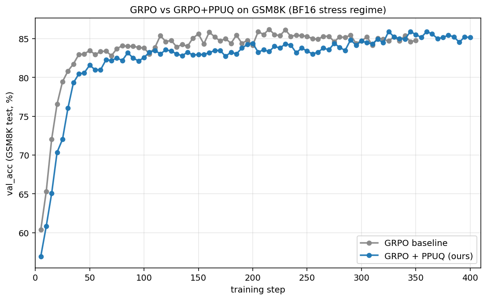
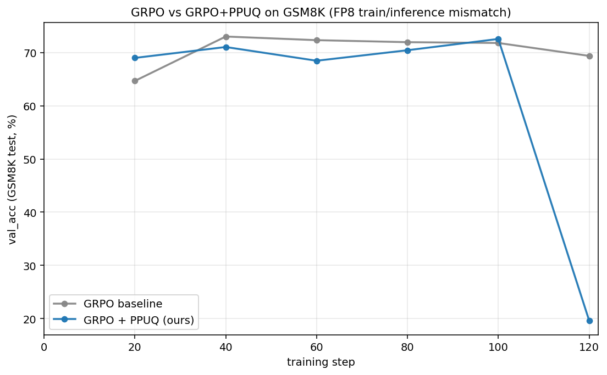

<!--
Slide deck for advisor presentation.
Each `---` is a slide break (Marp / reveal-md compatible).
Render: `marp slides.md -o slides.pdf`  or just read as markdown.
-->

---

# Token-level Selection for Stable GRPO

**Goal**: 在 GRPO 训练里挑 "学了会有效 / 不学会崩" 的 token 做 selection，提升 final accuracy 同时降低训练不稳定。

**进展**：从 Rho-1 失败（−2.88pp）→ 自己设计 **PPUQ** → BF16 +1.86pp / FP8 mismatch +0.75pp

---

## 1. 问题：GRPO 里所有 token 同等对待是浪费的

GRPO 的 PG loss：
$$
\mathcal{L}_{PG} = \mathbb{E}_t \left[ \frac{\pi_\theta(t)}{\pi_{\text{old}}(t)} A_t \right]
$$

- 每个 response token 得到**同样**的 advantage 权重
- 但实际上：少数 token 是"该学的关键步"，多数 token 是模板词、连接词
- **selection 假设**：识别哪些 token 该重点训练 → 提升效率 + 防崩

---

## 2. Phase 1 — Rho-1：从 SFT 直接搬过来

**Rho-1 的 score**：`score(t) = log π_ref(t) − log π_θ(t)` （ref-based excess loss）

**实验**：keep top 60% token in PG mask，120 step
- baseline: **82.18%** | Rho-1: **79.30%** → **−2.88pp**

**为什么失败**：
1. **ref ≠ tutor**：SFT 里 ref 是强 tutor，这里 ref = 训练起点的 Qwen，没有 oracle 能力
2. **score 选的不是"危险" token**：选出来的是"policy 已漂移"的 token
3. **学习信号变保守**：kl_loss 降 14%，policy 实际移动减少

**结论**：score 方向（mismatch-aware）是对的，但用 ref 作锚不行 → 改用 **engine-level train/rollout mismatch** 作信号

---

## 3. PPUQ 方法设计

### 核心三个旋钮

| 旋钮 | 选择 | 设计理由 |
|---|---|---|
| **Score** | K3 KL: `exp(log_r) − log_r − 1`,其中 `log_r = log π_train − log π_rollout` | 双向 KL 的对称估计,正值 = train 比 rollout 更自信(危险信号) |
| **Threshold** | **per-prompt** quantile (q=0.95) | 适应每个 prompt 的难度,简单 prompt 不会 dominate filter |
| **Action** | hard drop top 5% token (mask out from PG) | 直接砍而不是 reweight,避免 IS 高方差 |

### 实现位置
- [verl/trainer/ppo/rollout_corr_helper.py](../verl/trainer/ppo/rollout_corr_helper.py) 新增 `compute_per_prompt_quantile_mask()`，作为 verl rollout_correction 的 PPUQ fast path
- 启动：`algorithm.rollout_correction.rollout_rs=per_prompt_k3_quantile`

---

## 4. PPUQ 跟相关工作的关键差异

| 方法 | Score | Threshold | Granularity | Action |
|---|---|---|---|---|
| **Rho-1** (SFT, 失败) | `log π_ref − log π_θ` (ref-based) | top-K ratio | response | hard drop |
| **verl token_rs** | K3 KL (same as ours) | **global hard threshold** (e.g. 0.02) | token | hard drop |
| **AR-Lopti** | `−log π_θ` (prob only) | binary split at η=0.5 | token | reweight (α-blend) |
| **prob-only PPUQ** (ablation) | `−log π_old` (prob only) | per-prompt quantile | per-prompt | hard drop |
| **K3-PPUQ (我的)** | **K3 KL** (mismatch) | **per-prompt quantile** | per-prompt | hard drop |

### PPUQ 的两个独有点
1. **Score = mismatch (K3)，不是 prob**
   - prob-only score 只能找"罕见 token"
   - K3 score 找"train/rollout disagree 的 token"——更直接对齐 GRPO 的 off-policy 风险
2. **Threshold per-prompt，不是 global**
   - global threshold 会让简单 prompt 的全部 token 集体 dominate filter
   - per-prompt q=0.95 保证**每个 prompt 都精确 drop 5% token**——稳定的 selection 比例

---

## 5. Phase 2 — BF16 stress regime（实证 +1.86pp）

**Setup**: Qwen2.5-3B + LoRA, GSM8K, kl=0, lr=1e-5, 400 step

**实验设计**：先跑 baseline 350 步建立公共基线 → 从 step 350 ckpt 续训：另起一条 PPUQ 跑 50 步到 step 400

| | val_acc step 400 | Δ |
|---|---|---|
| GRPO baseline (step 350) | 84.8% | — |
| **GRPO + PPUQ (resume 350→400)** | **86.66%** ★ | **+1.86pp** |

→ 50 步内单调爬升 84.8% → 86.66%，完全归因于 PPUQ 的 selection

---

## 6. Phase 3 — 人为放大 mismatch 验证 PPUQ 鲁棒性

**动机**：BF16 的自然 mismatch (`rollout_probs_diff_mean ≈ 0.003`) 偏小。用 vLLM **FP8 rollout quantization** 把 mismatch 放大 ~4× (≈ 0.012) 测试 PPUQ 在更恶劣环境下是否仍有效。

**Setup**: Qwen2.5-1.5B full-params + FP8 vLLM rollout, kl=0.001, lr=5e-6, 120 step

| | val_acc step 99 (best stable) | Δ |
|---|---|---|
| GRPO baseline | 71.80% | — |
| **GRPO + PPUQ (我的)** | **72.55%** ★ | **+0.75pp** |

→ mismatch 放大 4× 下 PPUQ 仍持稳定优势（caveat: step 120 累积 hard-drop 失稳，best ckpt 取 step 80-100）

---

## 7. 三段递进对比汇总

| Phase | Setup | baseline | PPUQ (ours) | Δ |
|---|---|---|---|---|
| 1 | Rho-1 keep=0.6, 120 step | 82.18% | 79.30% | **−2.88pp**(失败) |
| 2 | BF16 stress, 350→400 续训 | 84.8% | **86.66%** | **+1.86pp** ★ |
| 3 | FP8 mismatch, step 99 | 71.80% | **72.55%** | **+0.75pp** ★ |

**Take-away**:
- **Phase 1 → 2**：从"乱选 token 反而坏"到"智能选 token 增益 +1.86pp"
- **Phase 2 → 3**：从"自然 mismatch"到"放大 mismatch"，PPUQ 仍持优势 → 鲁棒性证据

---

## 8. 下一步

1. **稳定性补丁**：解决 Phase 3 step 120 累积失稳 → 试动态 q（早期 q=0.99 少 drop，后期 q=0.95 多 drop）或 soft reweight
2. **更长 horizon**：H100 上跑 FP8 E2E 完整 400 步看 PPUQ 是否持续主导（venv_megatron 已装好）
3. **MATH dataset**：换长 response 任务看 K3 在 long sequence 上的表现
4. **完整 ablation**：q ∈ {0.90, 0.95, 0.99}, score ∈ {K1, K2, K3, neg_logp, abs_log_ratio}

---

## Appendix — 工程 artifact

| 文件 | 用途 |
|---|---|
| [run_gsm8k_demo.sh](../run_gsm8k_demo.sh) | GRPO baseline + LoRA |
| [run_gsm8k_rho1.sh](../run_gsm8k_rho1.sh) | Phase 1 Rho-1 ablation |
| [run_gsm8k_ppuq.sh](../run_gsm8k_ppuq.sh) | **GRPO + PPUQ (我的)** |
| [run_gsm8k_fp8roll.sh](../run_gsm8k_fp8roll.sh) | Phase 3 FP8 mismatch regime |
| [verl/trainer/ppo/rollout_corr_helper.py](../verl/trainer/ppo/rollout_corr_helper.py) | PPUQ 实现 |

**Best checkpoint**:
- BF16 final（86.66%）：`/mnt/data1/jinlong/ckpts/k3_ppuq_from_base350/global_step_400`
- FP8 best（72.55%）：`/mnt/data1/jinlong/ckpts/qwen1.5b_full_fp8roll_k3ppuq_v3/global_step_80`

**Repo**: https://github.com/JlPang863/verl-ppuq
